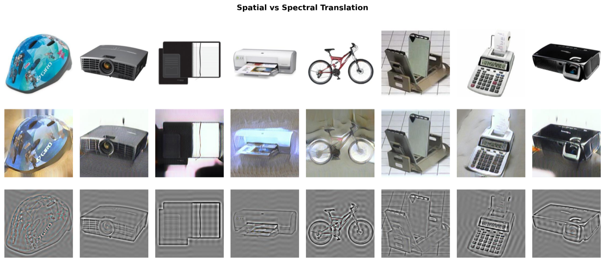
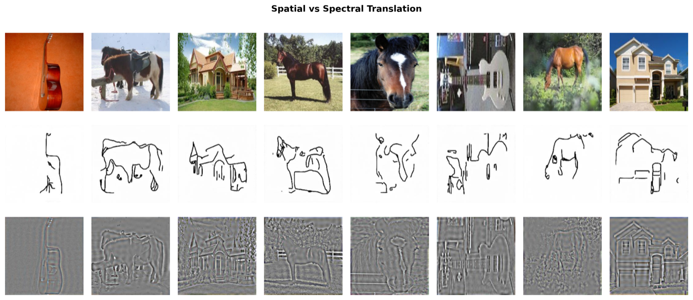

# Input-Space Domain Adaptation: Pixel vs. Frequency CycleGAN

Unsupervised domain adaptation (UDA) without touching model internals — just translate
the source domain to look like the target domain, then train a classifier on the
result. This repo implements and compares five ways of doing that:

- **Source-only** — no adaptation, just a sanity-check baseline
- **Spatial CycleGAN** — the standard pixel-space CycleGAN
- **Spectral CycleGAN** — a variant that only translates the *low-frequency amplitude*
  of the image's FFT, leaving phase (i.e. edges and structure) untouched
- **CyCADA** — CycleGAN plus a feature-level adversarial loss on top
- **FDA** — no GAN at all, just swap low-frequency FFT bands directly between a source
  and a random target image

This was built for the AI6126 (Advanced Computer Vision) course at NTU. The full
group report covers five dataset pairs; this repo is my slice of the work, run on two
of them:

1. **Amazon → Webcam** (Office-31) — same objects, photographed on a clean studio
   background vs. a cluttered office webcam. The gap is mostly lighting and texture.
2. **Photo → Sketch** (PACS) — natural photographs vs. hand-drawn line sketches. The
   gap is a full change in visual modality, not just style.

Picking two very different domain gaps was the point: one is a "same modality,
different photometrics" problem, and one isn't. Frequency-domain methods behave very
differently on each.

## The core finding

Spatial CycleGAN changes pixels everywhere, so it transfers style strongly but can
distort or hallucinate content. Spectral CycleGAN only touches the FFT's low-frequency
band, so structure is perfectly preserved — but if the domain gap isn't purely
photometric, it barely changes anything at all.

**Amazon → Webcam** (gap = lighting/texture, i.e. mostly low-frequency):



FDA — which does nothing but swap that low-frequency band, no training required —
ends up beating everything here, including the fancier GANs.

**Photo → Sketch** (gap = structural, not photometric):



Spectral CycleGAN collapses to a flat gray "embossed" image and completely fails —
you cannot turn a photo into a line drawing by nudging its brightness spectrum. Spatial
CycleGAN is the only GAN variant that produces anything sketch-like.

### Classifier accuracy after adaptation

| Method | Amazon → Webcam | Photo → Sketch |
|---|---|---|
| Source-only | 50.8% | 17.8% |
| Spatial CycleGAN | 63.5% | 90.4% |
| Spectral CycleGAN | 38.8% | 24.3% |
| FDA (best β) | **94.1%** (β=0.09) | **99.6%** (β=0.01) |
| CyCADA | 59.5% | 96.4% |

Takeaway: the best method depends entirely on *what kind* of domain gap you have.
Frequency-domain tricks are cheap and excellent for photometric shifts, useless for
structural ones. The full group report covers three more dataset pairs (MNIST↔USPS,
SVHN↔MNIST, Art↔Real World) and the qualitative/quantitative breakdown behind these
numbers, but isn't included in this repo.

## Repo layout

```
config.py                    # all hyperparameters + paths (edit this, no CLI flags)
dataset.py                   # Amazon/webcam image folder loader for the CycleGANs
models.py                    # ResNet-9 generator + PatchGAN discriminator
utils.py                     # replay buffer, checkpointing, image grid saving

train_spatial.py             # Spatial CycleGAN
train_pure_spectral.py       # Spectral CycleGAN — fully frequency-domain generator
train_spectral_bottleneck.py # Spectral CycleGAN — spatial generator, freq-domain bottleneck
fda_data_translation.py      # FDA: direct FFT amplitude swap, no training

cycada/                      # CyCADA: CycleGAN + frozen classifier feature loss
resnet_finetune/             # ResNet-50 classifier used to score adapted images
model/generator.py           # standalone generator (used by the spectral scripts)

evaluate.py                  # run a trained generator over a single folder
evaluate_entire_data.py      # same, preserving class subfolder structure
```

## Setup

```bash
pip install -r requirements.txt
```

Data is expected as flat class-subfolder image directories, e.g.:

```
<DATA_ROOT>/amazon/<class>/*.jpg
<DATA_ROOT>/webcam/<class>/*.jpg
```

For the PACS run, point the same layout at `photo/` and `sketch/` directories — the
loaders don't care about the actual folder names beyond what you set in `config.py`.

## Running it

There's no CLI — every script reads its settings from `config.py` (or
`resnet_finetune/config.py` for the classifier). Set `DATA_ROOT`, `OUTPUT_DIR`,
`CHECKPOINT_DIR`, and `NUM_EPOCHS`, then:

```bash
python train_spatial.py                 # Spatial CycleGAN
python train_pure_spectral.py           # Spectral CycleGAN (pure frequency)
python train_spectral_bottleneck.py     # Spectral CycleGAN (bottleneck variant)
python cycada/train_cycada.py           # CyCADA (needs a trained classifier checkpoint first)
python fda_data_translation.py          # FDA — no training, just batch-translates a folder
```

To finetune the ResNet-50 classifier used for evaluation:

```bash
python -m resnet_finetune.train
```

To translate a whole dataset with a trained checkpoint (used to build the
classifier's training set for the CycleGAN-UDA methods):

```bash
python evaluate_entire_data.py \
    --checkpoint checkpoints_amazon/spatial/epoch_099.pth \
    --mode spatial --direction A2D \
    --input_dir data/amazon --output_dir outputs/amazon_to_webcam
```

Both spatial and spectral training runs periodically save a sample image grid to
`OUTPUT_DIR` and a checkpoint to `CHECKPOINT_DIR`, and can resume from the latest
checkpoint by setting `RESUME = True` in `config.py`.

## References

- Zhu et al., *Unpaired Image-to-Image Translation using Cycle-Consistent Adversarial
  Networks*, ICCV 2017
- Hoffman et al., *CyCADA: Cycle-Consistent Adversarial Domain Adaptation*, ICML 2018
- Yang & Soatto, *FDA: Fourier Domain Adaptation for Semantic Segmentation*, CVPR 2020
